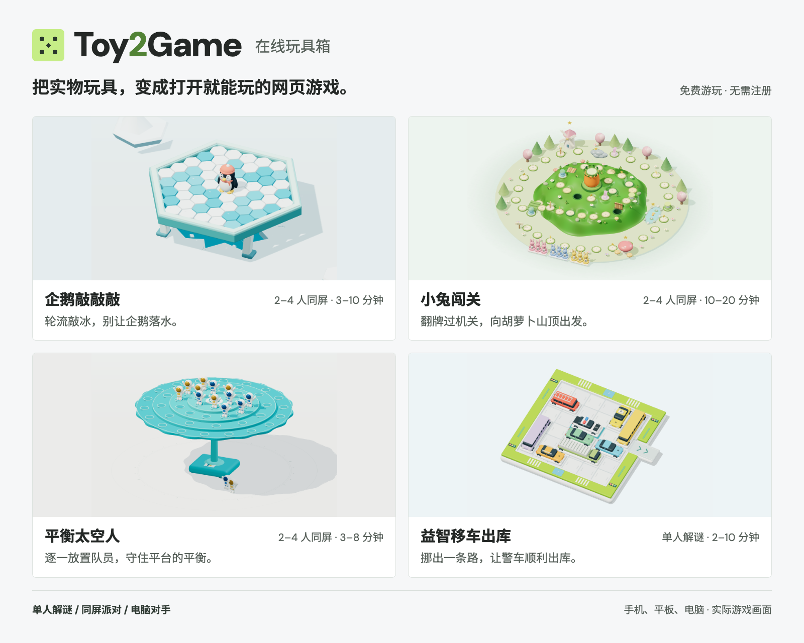
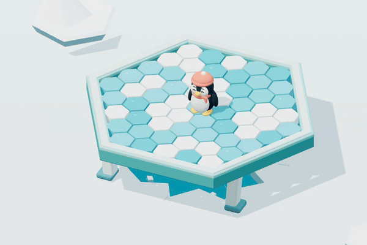
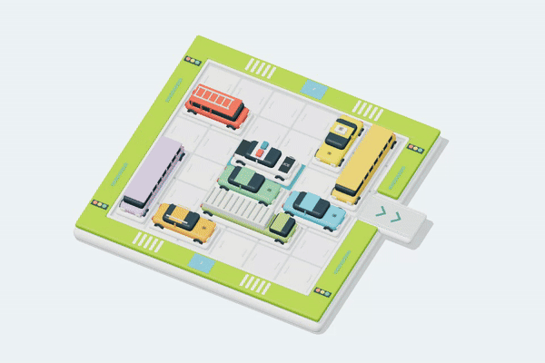
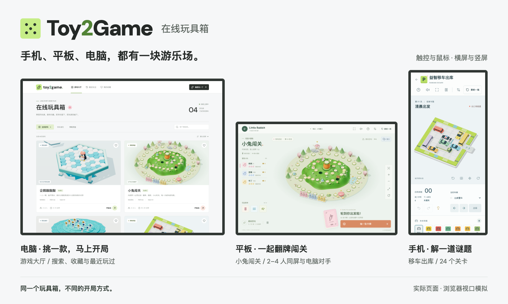

# Toy2Game · 在线玩具箱

**把实物玩具，变成打开就能玩的网页游戏。**

把平板放到桌子中间，轮流敲冰、翻牌、挑战平衡；一个人也能解一道移车谜题。

目前已有 **4 款可以实际游玩的 3D 网页游戏**，支持同屏游玩与电脑对手，适配手机、平板和电脑。免下载，免注册。

**[源码开放 · 非商业使用免费 · 商业使用须经作者事先书面授权](LICENSE)**

**[立即试玩](https://games.asmo.top/)** · [为什么做这个](#为什么做这个) · [看看实际效果](#看看实际效果) · [游戏一览](#游戏一览) · [本地运行](#快速开始) · [一起做下一款](#参与贡献)



A browser-based toy box: playful 3D games for solo puzzles and local multiplayer.

## 为什么做这个

很多桌面玩具的乐趣，藏在一个小小的动作里：敲掉一块冰之后的摇晃，翻开卡牌之前的期待，把最后一位太空人放上去时的犹豫。Toy2Game 希望把这些互动变成随手可玩的网页体验，让家人朋友更容易坐下来玩一局，也减少购买、摆放和收纳玩具的负担。

**少买一件玩具，多一点快乐。** 一块屏幕可以轮流递给朋友，也可以在独处时陪你解一道谜题。

制作时，先保留玩具可辨认的造型和关键互动，再加入电脑对手、自动结算、提示和进度保存等数字版玩法。希望每新增一件玩具，都有值得真正动手玩一玩的地方。

## 看看实际效果

下面两段都录自实际对局：企鹅因支撑被拆除而坍塌落水，警车则经过四步合法移动驶出第一关。

| 敲掉支撑，连锁坍塌 | 挪动车辆，四步出库 |
| --- | --- |
|  |  |

- **和家人朋友一起玩**：企鹅、小兔和太空人支持 2 至 4 个同屏席位，轮到谁就由谁操作，也可以加入电脑对手。
- **一个人休息一会儿**：选择电脑对手，或在移车出库的 120 个关卡里挑战更少步数。
- **把玩具拿近一点看**：3D 场景可以旋转、缩放和复位，支持触控与鼠标；浏览器允许时可以进入全屏。

所有游戏都从大厅进入。大厅可以搜索、分类、收藏、查看最近玩过，也可以“随便玩一个”。

## 游戏一览

| 游戏 | 怎么玩 | 人数与节奏 | 已实现的玩法 |
| --- | --- | --- | --- |
| [企鹅敲敲敲](https://games.asmo.top/games/penguin-ice/) | 轮流敲冰，别让企鹅失去支撑落水 | 2–4 个席位，约 3–10 分钟 | 37 / 61 块冰场、连锁坍塌、电脑对手 |
| [小兔闯关](https://games.asmo.top/games/rabbit-trap/) | 翻牌前进，穿过机关，争先登上胡萝卜山顶 | 2–4 个席位，约 10–20 分钟 | 55 格地图、道具与天气、全电脑对战、对局存档 |
| [平衡太空人](https://games.asmo.top/games/balance-astronaut/) | 把队员逐一放上平台，守住重心与平衡 | 2–4 个席位，约 3–8 分钟 | 48 个停靠位、轮流放置、骰子挑战、电脑对手 |
| [益智移车出库](https://games.asmo.top/games/parking-escape/) | 沿车身方向挪车，让警车从出口驶出 | 单人，约 2–10 分钟 | 120 个独立关卡、撤销 / 重做、下一步提示、进度存档 |

点击游戏名直接试玩。多人游戏中的席位可以包含电脑；时长为参考值。具体规则、数字版改编与参考来源：[企鹅](games/penguin-ice/README.md)、[小兔](games/rabbit-trap/README.md)、[太空人](games/balance-astronaut/README.md)、[移车](games/parking-escape/README.md)。

当前多人模式为**本地同屏轮流操作**，暂不支持异地联机。小兔闯关和移车出库支持刷新续玩；企鹅与太空人保存设置，刷新后重新开局。收藏、设置和存档都保存在当前浏览器。

## 在不同屏幕上玩



上图来自浏览器中的实际页面，按桌面、平板和手机视口截取。设备外框仅用于展示，不代表真实硬件测试。

## 快速开始

需要 **Node.js 22.18.0 或更高版本**和 npm；推荐使用 [`.node-version`](.node-version) 指定的 **22.21.1**。

```sh
git clone https://github.com/asmoyou/toy2game.git
cd toy2game
npm ci
npm run dev
```

打开 **http://localhost:5173/**，在大厅选择游戏即可开始。所有命令均在仓库根目录执行。

手机或平板与电脑连接同一 Wi-Fi 后，可以访问终端打印的 **Network** 地址；电脑需要保持服务运行。使用 `Ctrl+C` 停止服务。

开发服务将大厅、四款游戏和热更新统一到 **5173** 端口。重复启动会复用同仓库实例；端口被其他项目占用时会提示并退出。

## 技术与目录

项目是一个纯静态网站，无需后端、数据库或 API 密钥。使用 **npm workspaces + TypeScript + Vite** 管理；大厅使用 **React**，3D 场景使用 **Three.js**，物理玩法使用 **cannon-es**，回合与棋盘规则使用 **boardgame.io**，小兔场景动画使用 **GSAP**。

```text
apps/web/                 中文游戏大厅
games/
  penguin-ice/             企鹅敲敲敲
  rabbit-trap/             小兔闯关
  balance-astronaut/       平衡太空人
  parking-escape/          益智移车出库
packages/catalog/         游戏登记、站点文案、收藏与最近游玩
scripts/                  统一开发、构建、预渲染、测试与截图
tests/                    登记契约与站点浏览器测试
docs/                     接入、部署、SEO 与介绍素材
```

大厅和游戏是独立 HTML 入口，通过普通链接跳转，游戏地址为 `/games/<id>/`。大厅不加载 Three.js 或游戏引擎，也不通过 iframe 承载游戏。各游戏独立维护规则、场景、依赖与测试，共用根目录的 `package-lock.json`。

[`packages/catalog/games.json`](packages/catalog/games.json) 是唯一游戏登记表，大厅、构建脚本与 SEO 内容共同读取它。站点级文案位于 [`packages/catalog/site.json`](packages/catalog/site.json)。

## 构建与部署

```sh
npm run build
npm run preview
```

完整站点输出到根目录 **`dist/`**，包含大厅、四款游戏及其资源、文字版介绍和 404 页面。开发与生产预览均使用 5173；切换前用 `Ctrl+C` 停止当前服务，预览结束后同样关闭服务。

可部署到支持目录索引与真实 HTTP 404 的静态托管服务。仓库已提供 **Cloudflare Workers Static Assets** 配置，见 [Cloudflare 部署指南](docs/cloudflare.md)。

- 子目录部署：使用 `SITE_BASE=/toy2game/ npm run build`，预览时同样设置 `SITE_BASE=/toy2game/`。
- 正式域名：设置构建环境变量 `SITE_ORIGIN`，或填写 `packages/catalog/site.json` 的 `origin`。
- SEO 与可读取资料：构建生成页面元信息、结构化数据、首页预渲染、`robots.txt`、`llms.txt` 及游戏文字版。未配置正式域名时省略 canonical、绝对分享图片地址和 sitemap，详见 [SEO 与智能体发现](docs/seo.md)。

## 开发与验证

| 命令 | 用途 |
| --- | --- |
| `npm run dev` | 启动统一开发服务 |
| `npm test` | 登记契约及各游戏规则、物理测试 |
| `npm run build` | 类型检查并构建完整生产站点 |
| `npm run test:e2e` | 启动生产预览，运行站点浏览器回归 |
| `SITE_URL=http://localhost:5173/ npm run test:games` | 对已运行的开发服务执行各游戏浏览器回归 |
| `npm run covers` | 对已运行的开发服务重新截取大厅封面 |

运行 `test:e2e` 前先完成本次改动的构建，并停止开发服务。站点浏览器测试覆盖桌面和手机上的大厅操作、游戏入口、画布像素与交互、资源加载和 404。

<details>
<summary>浏览器安装、局部验证与截图</summary>

浏览器测试默认使用本机 Google Chrome。没有 Chrome 时：

```sh
npx playwright install chromium
PLAYWRIGHT_CHANNEL=chromium npm run test:e2e
```

各游戏详细回归需要开发模式诊断接口。先在一个终端运行 `npm run dev`，在另一个终端运行：

```sh
npx playwright install webkit
SITE_URL=http://localhost:5173/ npm run test:games
```

可用 `npm test --workspace games/<id>` 验证某款游戏。企鹅另有电脑行为、体验与物理平衡回归，具体命令见其 README；`test:games` 不包含这些专项测试。

开发服务运行时，执行 `node tests/browser/dev-server.mjs`，可以检查重复启动复用、全部游戏资源与单端口热更新。设备模拟不能替代真实 iPad Safari 硬件测试。

游戏画面更新后，可用 `GAME_ID=parking-escape npm run covers` 单独更新封面。介绍图的重制方法见 [介绍素材说明](docs/readme-assets.md)。临时截图和报告保存在被忽略的 `artifacts/`、`test-results/` 等目录。

</details>

## 参与贡献

**下一件玩具，做什么？** 你小时候反复玩过的、最近觉得有意思的，或想和家人朋友一起玩的桌面玩具，都可以来聊聊。

欢迎带着玩具线索、清楚的规则或一段试玩反馈来参与。也欢迎改进现有游戏的触控体验、性能和文档，让这个玩具箱一点点装满。

- **反馈问题**：通过 [Issues](https://github.com/asmoyou/toy2game/issues) 描述游戏名称、设备与浏览器、复现步骤和预期结果；画面问题可以附上截图。
- **讨论新游戏**：先说明玩具的关键互动、人数、胜负规则，以及参考资料来源。图片无法确定的规则请单独列出。
- **提交改动**：先阅读 [开发规范](AGENTS.md)，按改动范围运行测试；规则或画面有变化时同步说明与实际截图。
- **接入新游戏**：遵循 [新游戏接入约定](docs/adding-games.md)，提供独立入口、登记信息、实际封面、全屏切换及必要测试。

## 素材与许可

游戏场景主要由 Three.js 程序化建模，README 介绍图使用实际游戏截图排版制作。各游戏 README 记录参考来源、规则依据和数字版差异；本项目并非所参考实体产品的官方版本。

网页使用本地加载的 DM Sans 与 Noto Sans SC 字体，均允许在遵守 SIL Open Font License 的前提下免费商用；许可证分别保留在 [DM Sans](apps/web/public/fonts/OFL.txt) 和 [Noto Sans SC](apps/web/public/fonts/noto-sans-sc-OFL.txt)。字体通过本站提供，不依赖远程字体服务，第三方依赖各自遵循其许可证。

本项目采用自定义的 [Toy2Game Noncommercial License 1.0](LICENSE)：

- **非商业使用免费**：允许学习、研究、个人娱乐，以及非商业目的的使用、修改和分发。
- **保留许可与署名**：分发时保留版权声明、完整许可证和第三方声明，并标明所作修改。
- **商用须先获授权**：收费运营、广告变现、商业产品集成、付费客户交付和企业内部商业用途等，均须事先取得作者 **asmoyou** 的书面授权。修改代码或免费向用户提供服务不自动免除这一要求。

商业授权可通过 [GitHub Issues](https://github.com/asmoyou/toy2game/issues) 或 [作者主页](https://github.com/asmoyou) 发起申请，说明用途、分发或部署方式及收费模式。授权范围以双方书面约定为准，提交申请本身不代表获准。

这里的“源码开放”指 **Source Available**。由于限制商业使用，本许可证不属于 [OSI 定义的开源许可证](https://opensource.org/osd)，具体条款以 `LICENSE` 为准；第三方依赖和素材继续适用各自的许可。
